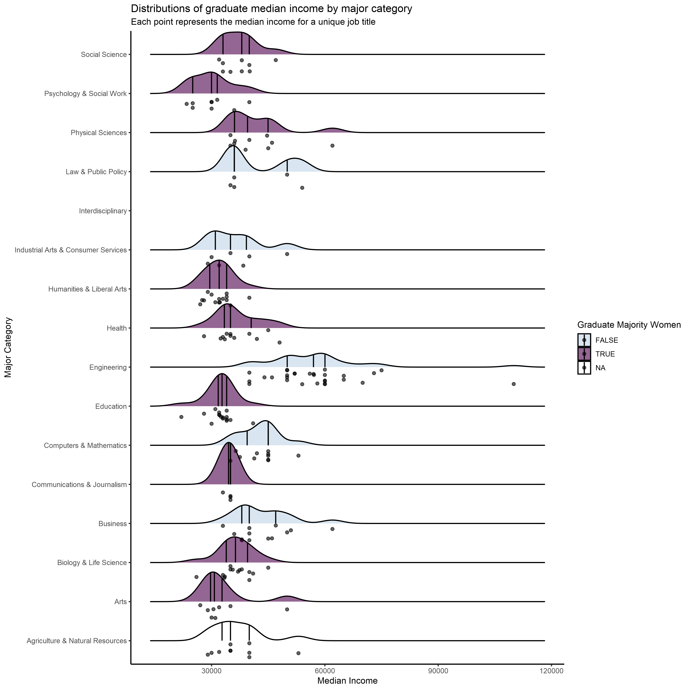

```{r setup, include=FALSE}
library(formatR)
library(knitr)
knitr::opts_chunk$set(echo = TRUE)
opts_chunk$set(echo = TRUE)
opts_chunk$set(tidy.opts=list(width.cutoff=50),tidy=TRUE)

```

```{r setup, message = FALSE}
library(readr)
library(tidyr)
library(dplyr)
library(ggplot2)
library(Cairo)
```

----

##Import

```{r import, message = FALSE}
grad <- read_csv("recent-grads.csv")
```

----

##Wrangle

```{r wrangle}
grad$Major_category <- factor(grad$Major_category)

grad_wom <- grad %>%
     group_by(Major_category) %>%
     summarize(sharewomen_mean = mean(ShareWomen), sharewomen_sd = sd(ShareWomen))

grad_wom$sharewomen_mean <- round(grad_wom$sharewomen_mean, digits = 2)
grad_wom$sharewomen_sd <- round(grad_wom$sharewomen_sd, digits = 2)
```

----

##Visualize

```{r visualize}
#Boxplot of Median income by major category
grad %>%
    mutate(Major_category = fct_reorder(Major_category, ShareWomen)) %>%
    ggplot(aes(x = Major_category, y = Median, fill = Major_category)) +
    geom_boxplot() +
    geom_jitter() +
    coord_flip() +
    guides(fill = FALSE)
```

##Visualize 2

```{r visualize 2}
#Ridge plot with jittered points representing the distributions of median incomes by major categories
#
grad_ridges <- grad %>%
    group_by(Major_category) %>%
    mutate(majority_women = mean(ShareWomen) > 0.50) %>%
    ggplot(aes(x = Median, y = Major_category, fill = majority_women)) +
    geom_density_ridges(quantile_lines = TRUE, quantiles = c(0.25, 0.5, 0.75),
                        jittered_points = TRUE, position = "raincloud", alpha = 0.6, scale = 1.0) +
    scale_fill_manual(values = c("#BFD3E6", "#4d004b")) +
    guides(fill = guide_legend("Graduate Majority Women")) +
    labs(x = "Median Income",
         y = "Major Category",
         title = "Distributions of graduate median income by major category", 
         subtitle = "Each point represents the median income for a unique job title") +
    theme_classic()
```

Export grad_ridges
```{r export, message = FALSE}
CairoPNG(filename = "week29.png", units = "in", width = 12, height = 12, pointsize = 12, res = 300)

print(grad_ridges)

dev.off()
```




##Visualize 3

```{r}
#Scatterplot of mean proportion of women graduates across major categories (error bars represent standard deviation)
grad_wom %>%
    group_by(Major_category) %>%
    ggplot(aes(x = reorder(Major_category, sharewomen_mean), y = sharewomen_mean, color = Major_category)) +
    geom_point() + 
    geom_errorbar(aes(ymax = sharewomen_mean + sharewomen_sd, ymin = sharewomen_mean - sharewomen_sd)) +
    coord_flip() +
    guides(color = FALSE)
```


