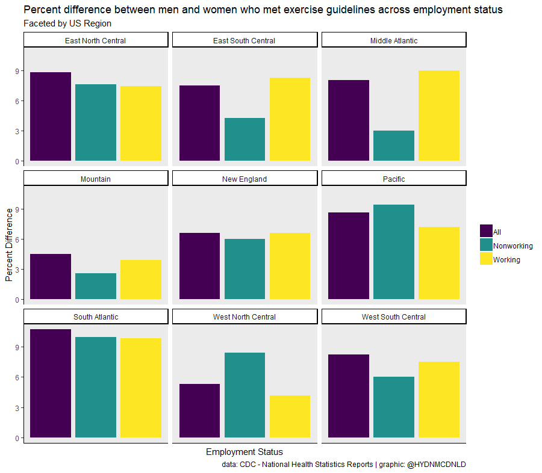

```{r setup, echo=FALSE}
library(formatR)
library(knitr)
opts_chunk$set(echo = TRUE)
opts_chunk$set(tidy.opts=list(width.cutoff=50),tidy=TRUE)

library(readxl)
library(dplyr)
library(tidyr)
library(ggplot2)
library(purrr)
library(stringr)
```


## Data import
```{r import}
xdata <- read_xlsx("week16_exercise.xlsx", sheet = 1, col_names = TRUE, range = cell_cols("B:I"))
```

## Data cleaning
```{r cleaning}
#wide to long format
xdata2 <- gather(xdata, group, percent, -state)

#convert percent to numeric, group to factor
xdata2$percent <- as.numeric(xdata2$percent)
xdata2$group <- as.factor(xdata2$group)

glimpse(xdata2)
summary(xdata2)

xdata2 <- xdata2 %>%
  filter(!is.na(percent))
```


## Create a region df to join to our current data
```{r region}
Pacific <- c("California", "Oregon", "Washington", "Hawaii", "Alaska")
Mountain <- c("Nevada", "Idaho", "Montana", "Wyoming", "Utah", "Colorado", "New Mexico", "Arizona")
West_North_Central <- c("North Dakota", "South Dakota", "Minnesota", "Nebraska", "Kansas", "Iowa", "Missouri")
West_South_Central <- c("Oklahoma", "Arkansas", "Louisiana", "Texas")
East_North_Central <- c("Wisconsin", "Illinois", "Indiana", "Michigan", "Ohio")
East_South_Central <- c("Kentucky", "Tennessee", "Mississippi", "Alabama") 
South_Atlantic <- c("West Virginia", "Virginia", "District of Columbia", "Maryland", "Delaware", "North Carolina", 
                    "South Carolina", "Georgia", "Florida")
Middle_Atlantic <- c("Pennsylvania", "New York", "New Jersey")
New_England <- c("Conneticut", "Rhode Island", "Massachusetts", "New Hampshire", "Vermont", "Maine")

region_list <- list(Pacific = Pacific, 
                    Mountain = Mountain, 
                    West_North_Central = West_North_Central, 
                    West_South_Central = West_South_Central, 
                    East_North_Central = East_North_Central, 
                    East_South_Central = East_South_Central,  
                    South_Atlantic = South_Atlantic, 
                    Middle_Atlantic = Middle_Atlantic, 
                    New_England = New_England)

#Create a tibble to map region onto states
region_df <- region_list %>%
     map_df(~ data_frame(state = .x), .id = "region")

region_df
```

## Map region onto states
```{r}
xdata2 <- xdata2 %>%
  inner_join(region_df, by = "state")

xdata2$region <- str_replace_all(xdata2$region, patter = "_", replacement = " ")

glimpse(xdata2)
```


## Calculate differentials
```{r data wrangling}
xdatam <- xdata2 %>%
    spread(group, percent) %>%
    group_by(region) %>%
    mutate(All = men - women, 
           Working = men_working - women_working, 
           Nonworking = men_nonworking - women_nonworking)
    
m <- xdatam %>%
  gather(group, percent, -state, -region) %>%
  filter(group %in% c("All", "Working", "Nonworking")) %>%
  group_by(region, group) %>%
  summarize(avg_region = mean(percent, na.rm = TRUE))
```


## Visualize
```{r viz}
library(viridis)
palette <- viridisLite::viridis(3)
palette

# Plot
xplot <- ggplot(data = m, aes(x = as.factor(group), y = avg_region, fill = group)) + 
    geom_col(position = "dodge") +
    facet_wrap(~ region) + 
    theme_classic() +
    scale_fill_manual(values = palette) +
    labs(title = "Percent difference between men and women who met exercise guidelines across employment status", 
         subtitle = "Faceted by US Region", 
         caption = "data: CDC - National Health Statistics Reports | graphic: @HYDNMCDNLD", 
         x = "Employment Status", y = "Percent Difference") + 
    theme(panel.background = element_rect(fill = "gray92"), 
          legend.title = element_blank(), 
          axis.text.x = element_blank(),
          axis.ticks.x = element_blank())
```




