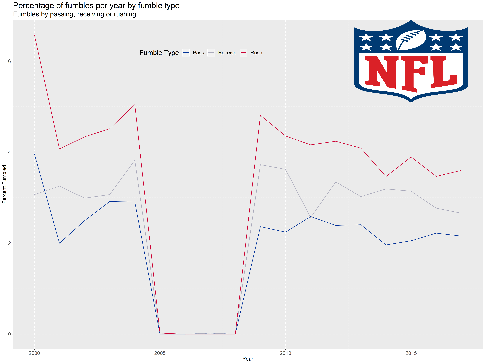

```{r setup, message = FALSE, warning = FALSE}
library(formatR)
library(knitr)
knitr::opts_chunk$set(echo = TRUE)
knitr::opts_chunk$set(tidy.opts=list(width.cutoff=50),tidy=TRUE)

library(readxl)
library(dplyr)
library(tidyr)
library(ggplot2)
```

----

## Import Data
```{r}
fb <- read.csv("nfl_2010-2017.csv", header = TRUE)
```

----

## Wrangle

```{r}
fb2 <- fb %>%
    select(game_year, rush_fumbles, rec_fumbles, pass_fumbles) %>%
    group_by(game_year) %>%
    mutate_if(is.numeric, funs(ifelse(is.na(.), 0, .))) %>%
    summarize(pct_rush_fum = sum(rush_fumbles, na.rm = TRUE) / n() * 100, 
              pct_rec_fum = sum(rec_fumbles, na.rm = TRUE) / n() * 100, 
              pct_pass_fum = sum(pass_fumbles, na.rm = TRUE) / n() * 100)

# wide data
fb2

# convert data to long format
fb2l <- fb2 %>%
  gather(fum_type, percent_fum, -game_year)

fb2l
```

----

## Visualize

```{r}
fbvis <- fb2l %>%
    ggplot(aes(x = game_year)) +
    geom_line(aes(y = percent_fum, group = fum_type, color = fum_type)) +
    scale_color_manual(name = "Fumble Type", labels = c("Pass", "Receive", "Rush"), values = c("#003399", "#aaaabb", "#cc0033")) +
    labs(x = "Year", y = "Percent Fumbled", title = "Percentage of fumbles per year by fumble type", subtitle = "Fumbles by passing, receiving or rushing") + 
    theme(axis.line = element_line(size = 0.5, linetype = "solid"), 
          panel.grid.major = element_line(linetype = "dashed"), 
          panel.grid.minor = element_line(linetype = "dashed"), 
          panel.background = element_rect(linetype = "dashed"),
          legend.position = c(0.4, 0.9),
          legend.direction = "horizontal",
          legend.background = element_rect("gray92"), 
          axis.title = element_text(size = 12),
          axis.text = element_text(size = 12), 
          legend.text = element_text(size = 12), 
          title = element_text(size = 16))
```

----

## Add Logo and Export Visualization

```{r}
library(grid)
library(png)
library(Cairo)

#import logo
logo <- readPNG('nfllogo.png')

#insert logo
fbvis2 <- fbvis + annotation_raster(logo, ymin = 5, ymax = 7, xmin = 2012.5, xmax = 2017.5)


#render final image
png(filename="week22nfl.png",
    type="cairo",
    units="in", 
    width=16,      
    height=12, 
    pointsize=12, 
    res=300)
print(fbvis2)
dev.off()
```



----

## Session Info

```{r, echo = FALSE} 
sessioninfo::session_info()
```


