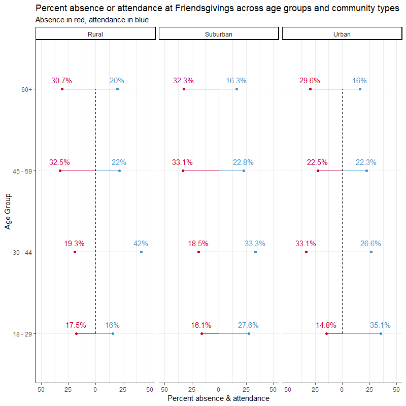

```{r setup, include=FALSE}
library(formatR)
library(knitr)
knitr::opts_chunk$set(echo = TRUE)
opts_chunk$set(echo = TRUE)
opts_chunk$set(tidy.opts=list(width.cutoff=50),tidy=TRUE)
```

```{r setup}
library(readr)
library(tidyr)
library(dplyr)
library(ggplot2)
```

```{r import}
food <- read_csv("thanksgiving_meals.csv")
```

```{r wrangle}
food <- food %>% 
  select(1:2, 52:53, 56:65)
```

```{r}
food %>%
    group_by(age, community_type, gender) %>%
    mutate(prop_friendsgiving = sum(friendsgiving == "Yes", na.rm = TRUE) / n()) %>%
    mutate(prop_no_friends = sum(friendsgiving == "No", na.rm = TRUE) / n()) %>%
    ggplot() +
    geom_boxplot(aes(x = age, y = prop_friendsgiving))
```


```{r proportion of participants taking part in friendsgiving}
food %>%
    group_by(age, community_type, gender) %>%
    summarize(prop_friendsgiving = sum(friendsgiving == "Yes", na.rm = TRUE) / n()) %>%
    ggplot() +
    geom_boxplot(aes(x = age, y = prop_friendsgiving)) +
    facet_wrap(~ community_type)
```

```{r compute percentage attendance / absence across age / community types}
food2 <- food %>%
    group_by(friendsgiving, age, community_type) %>%
    summarize(total = n()) %>%
    na.omit() %>%
    spread(key = age, value = total)

food2[, 3:6] <- round((food2[, 3:6]/rowSums(food2[, 3:6])), digits = 3) * 100

food2 %<>%
    gather(key = age, value = percent_friendsgiving, -friendsgiving, -community_type) %>%
    mutate(age = factor(age, levels = c("18 - 29", "30 - 44", "45 - 59", "60+"))) %>%
    group_by(age, community_type) %>%
    mutate(percent_diff = sum(percent_friendsgiving, na.rm = TRUE)) %>%
    mutate(percent_friendsgiving = case_when(friendsgiving == "No" ~ -percent_friendsgiving, 
                                             friendsgiving == "Yes" ~ percent_friendsgiving))
```

```{r mirror lollipop / cleveland dot plot}
friends <- food2 %>%
    ggplot(aes(x = age)) +
    geom_point(aes(y = percent_friendsgiving, 
                   color = friendsgiving)) +
    geom_segment(aes(xend = age, 
                     y = percent_friendsgiving, 
                     yend = 0, 
                     color = friendsgiving)) +
    geom_text(aes(y = percent_friendsgiving, 
                  label = paste0(abs(percent_friendsgiving), "%"), 
                  color = friendsgiving), 
              vjust = -1) +
    geom_line(aes(y = 0, 
                  group = community_type), 
              linetype = 2) +
    scale_y_continuous(limits = c(-50, 50), 
                       labels = abs(seq(-50, 50, 25))) +
    facet_wrap(~ community_type) +
    coord_flip() +
    theme_classic() +
    theme(panel.grid.major = element_line(size = 0.05, color = "gray92"), 
          panel.grid.minor = element_line(size = 0.05, color = "gray92")) +
    labs(title = "Percent absence or attendance at Friendsgivings across age groups and community types",
         subtitle = "Absence in red, attendance in blue",
         x = "Age Group", 
         y = "Percent absence & attendance") +
    scale_color_manual(values = c("#cc0033", "#4292c6"), guide = FALSE)
```

```{r}
library(Cairo)

CairoPNG(filename = "week34.png", units = "in", width = 9, height = 9, res = 300)

print(friends)

dev.off()
```




