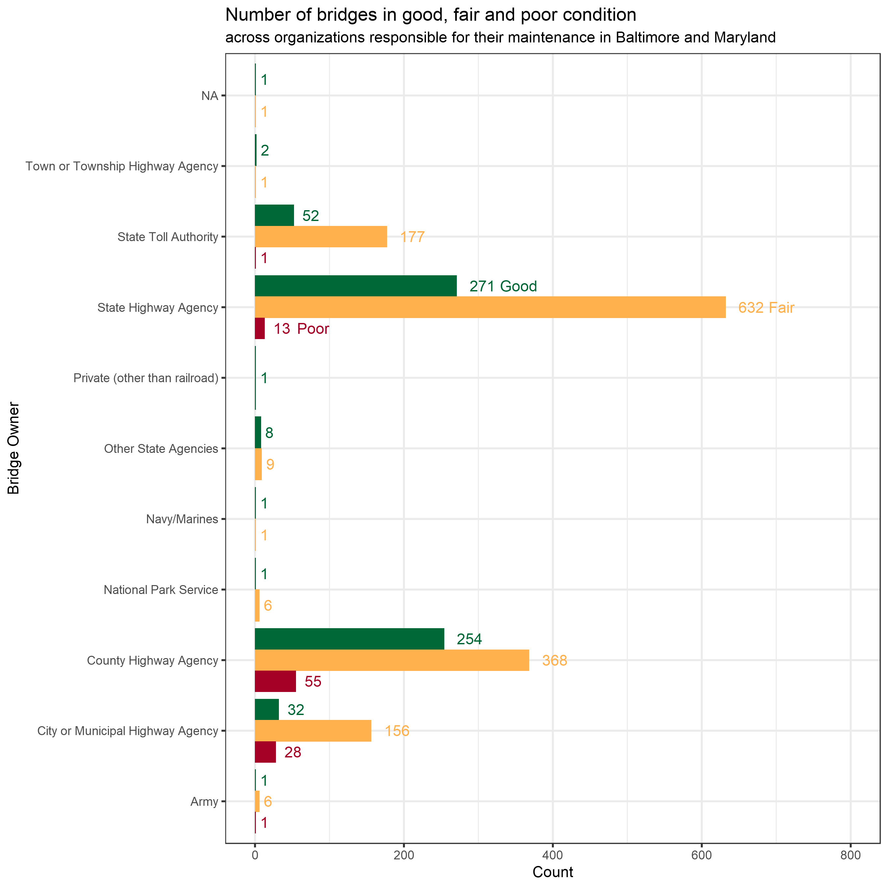

```{r setup, include=FALSE}
library(formatR)
library(knitr)
knitr::opts_chunk$set(echo = TRUE)
opts_chunk$set(echo = TRUE)
opts_chunk$set(tidy.opts=list(width.cutoff=50),tidy=TRUE)
```

```{r packages, message = FALSE, warnings = FALSE}
library(readr)
library(tidyr)
library(dplyr)
library(ggplot2)
```

```{r import}
bridges <- read_csv("baltimore_bridges.csv")
```

```{r wrangle}
bridges$bridge_condition <- factor(bridges$bridge_condition, levels = c("Poor", "Fair", "Good"))

bridges %<>%
    group_by(responsibility, bridge_condition) %>%
    summarize(count = n())

bridge_legend <- bridges %>%
  filter(responsibility == "State Highway Agency")
```

```{r viz}
library(Cairo)

CairoPNG(filename = "week35-baltimore-bridges.png", units = "in", width = 9, height = 9, res = 300)

bridges %>%  
    ggplot(aes(x = responsibility, 
               y = count, 
               fill = bridge_condition)) +
    geom_col(position = "dodge") +
    geom_text(aes(label = count, 
                  color = bridge_condition), 
              position = position_dodge(width = 0.9), 
              hjust = -0.5, 
              vjust = 0.5) + 
    geom_text(data = bridge_legend, aes(label = bridge_condition, 
                  color = bridge_condition), 
              position = position_dodge(width = 0.9), 
              hjust = c(-1.15, -1.65, -1), 
              vjust = 0.5) +
    scale_y_continuous(limits = c(0, 800)) +
    scale_fill_manual(values = c("#a50026", "#FFB14E", "#006837")) +
    scale_color_manual(values = c("#a50026", "#FFB14E", "#006837")) +
    coord_flip() +
    theme_bw() + 
    labs(title = "Number of bridges in good, fair and poor condition",
         subtitle = "across organizations responsible for their maintenance in Baltimore and Maryland",
         x = "Bridge Owner",
         y = "Count") +
    guides(fill = FALSE, color = FALSE)

dev.off()
```




